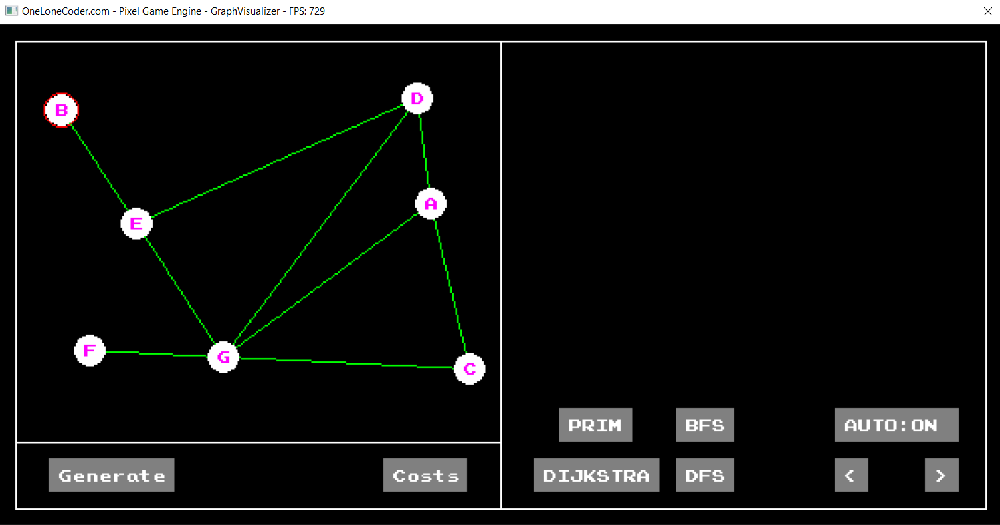
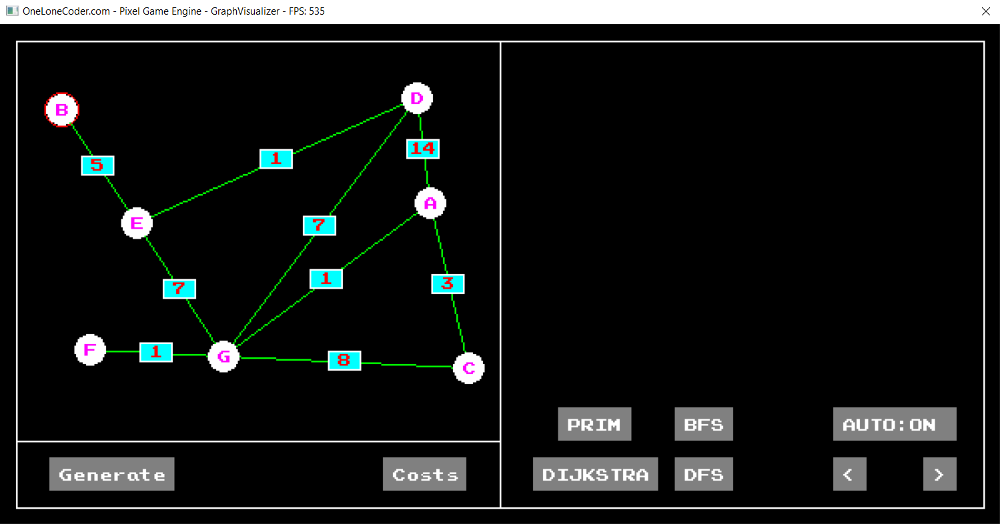
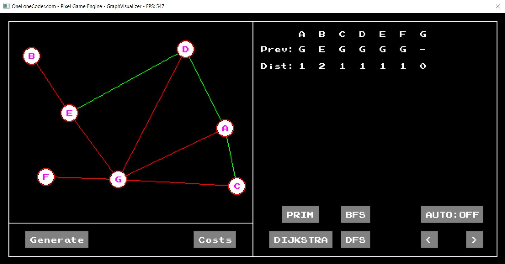
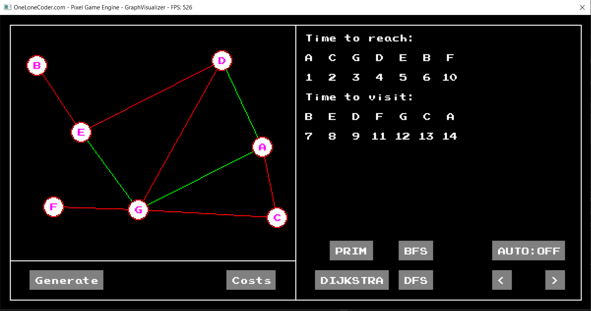
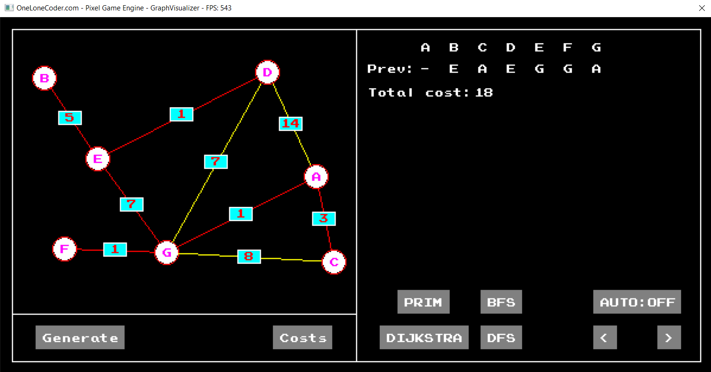
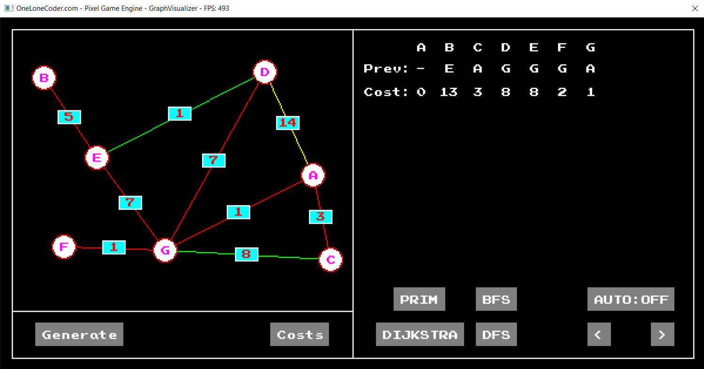

# Graph Algorithm Visualizer

## Description
The Graph Algorithm Visualizer is a C++ application that allows users to visualize various graph algorithms. The drawing is realized using OlcPixelGameEngine.

## Features
- **Graph Generation:** Generate random graphs.
- **Cost Display:** Show or hide edge costs for better visualization.
- **Algorithm Animation:**
    - **BFS:** Visualize Breadth-First Search algorithm step by step.
    - **DFS:** Visualize Depth-First Search algorithm step by step.
    - **Dijkstra's Algorithm:** Visualize Dijkstra's algorithm step by step.
    - **Prim's Algorithm:** Visualize Prim's algorithm step by step.
- **Animation Control:** Users can control the animation progress, stepping forward or backward as desired.
- **Node Movement:** Nodes can be moved using the mouse for custom graph layouts.

## Screenshots
*Main Page*

*Costs Display*

*BFS Algorithm*

*DFS Algorithm*

*Prim's Algorithm*

*Dijkstra's Algorithm*

